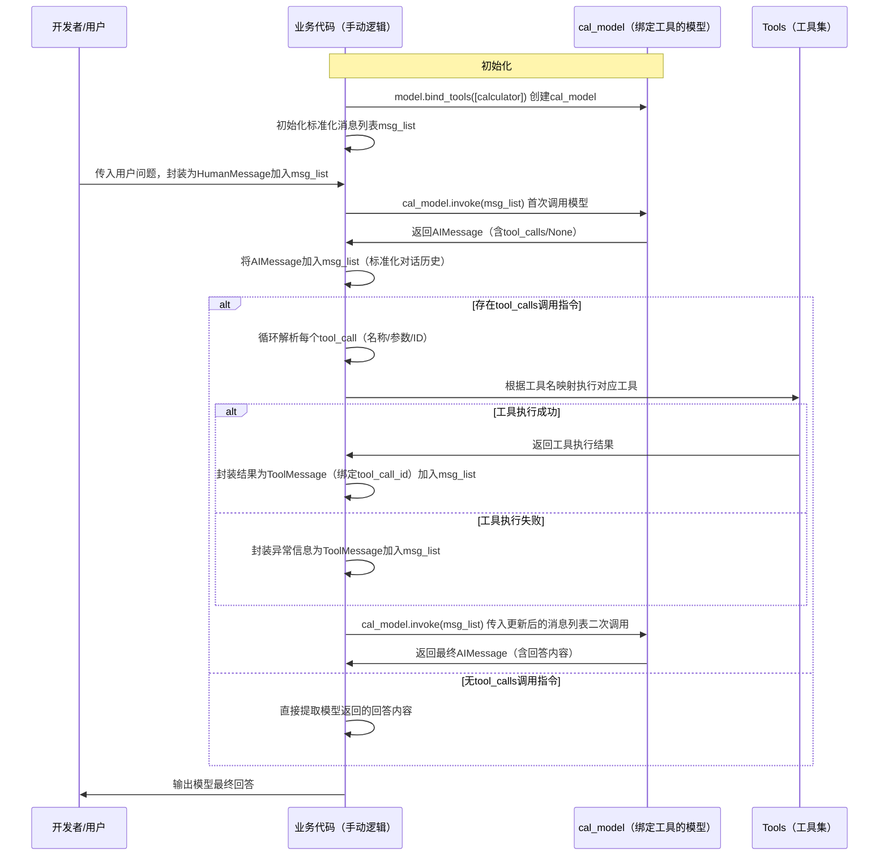

# LangChain实战开发教程（十）：工具定义与注册基础指南

> **掌握工具定义核心技能**：从基础工具定义开始你的AI工具扩展之旅

## 🎯 本文目标

深入理解LangChain工具定义与注册的核心机制，掌握@tool装饰器和StructuredTool两种定义方式，学会如何让AI智能识别并调用自定义工具。

### 📚 核心知识点概览

通过本文你将掌握：
- **工具定义方式**：@tool装饰器与StructuredTool类的使用
- **参数处理机制**：函数参数如何映射为工具输入
- **工具绑定技巧**：如何将工具绑定到模型
- **调用流程解析**：AI识别→调用→结果处理的完整流程
- **错误处理策略**：工具调用失败时的优雅处理

### 🎯 使用场景判断

✅ **推荐使用工具定义**：
- 需要AI调用外部API获取实时数据
- 需要执行数学计算或数据处理
- 需要访问数据库或文件系统
- 需要集成第三方服务
- 需要AI具备真实世界操作能力

❌ **不建议使用**：
- 纯文本生成和处理场景
- 不需要外部数据或操作的场景
- 简单的问答交互
- 对安全性要求极高且不允许外部调用的场景

## 💡 核心概念解释

**工具定义**：将普通Python函数包装成AI可识别和调用的工具，AI能够在合适的时机自动选择并调用这些工具获取所需信息或执行操作。

## 🔧 实施三步走

### 步骤1：环境配置准备 ⚙️

**前置条件**：
- 已完成基础同步调用环境配置
- 理解Python类型注解和Pydantic模型
- 准备工具定义所需的依赖库

```python
import os
from dotenv import load_dotenv
from langchain.chat_models import init_chat_model
from langchain_core.messages import HumanMessage
from langchain_core.tools import Tool, StructuredTool
from pydantic import BaseModel, Field

# 环境配置
config_path = os.path.join(os.path.dirname(os.path.dirname(os.path.dirname(__file__))), 'config.env')
load_dotenv(config_path)

os.environ["OPENAI_API_KEY"] = os.getenv('API_KEY')
os.environ["OPENAI_BASE_URL"] = os.getenv('BASE_URL')
model_name = os.getenv('MODEL')

def init_model(model=model_name):
    """初始化LLM模型"""
    return init_chat_model(
        model=model,
        model_provider="openai",
        temperature=0.7,
        timeout=30,
        max_tokens=1000,
        max_retries=3,
    )
```

### 步骤2：工具定义核心实现 🚀

####  工具定义详解

##### 方式1：使用@tool装饰器定义工具（推荐）

`@tool`装饰器是定义工具最简单的方法，默认情况下，函数的文档字符串会成为工具的描述，帮助模型理解何时使用该工具。

```python
from langchain.tools import tool

@tool
def calculator(num1: float, operation: str, num2: float) -> float:
    """
    执行基本数学运算的计算器工具，当需要进行数学计算时，请调用这个工具
    
    Args:
        num1: 第一个数字
        operation: 运算符 (+, -, *, /)
        num2: 第二个数字
        
    Returns:
        float: 计算结果
    """
    print(f"执行计算: {num1} {operation} {num2}")

    if operation == "+":
        return num1 + num2
    elif operation == "-":
        return num1 - num2
    elif operation == "*":
        return num1 * num2
    elif operation == "/":
        if num2 == 0:
            raise ValueError("除数不能为零")
        return num1 / num2
    else:
        raise ValueError(f"不支持的运算符: {operation}")
```

**@tool装饰器关键知识点**：
- 默认情况下，工具名称来源于函数名称
- 函数的文档字符串自动成为工具描述
- 支持通过type hints进行参数验证
- 自动处理参数解析和验证

**自定义工具名称和描述**：

```python
@tool("weather_search", description="根据传入的城市返回对应的天气信息，当你需要查询天气时，调用这个工具!")
def weather_checker(city: str) -> str:
    """
    模拟查询天气的工具
    
    Args:
        city: 城市名称
        
    Returns:
        str: 天气信息
    """
    print(f"查询 {city} 的天气")
    # 模拟天气数据
    weather_data = {
        "北京": "晴天，温度 15°C",
        "上海": "多云，温度 18°C",
        "广州": "雨天，温度 22°C",
        "深圳": "阴天，温度 20°C",
        "杭州": "晴天，温度 16°C"
    }
    return weather_data.get(city, f"暂无 {city} 的天气信息")
```

##### 方式2：使用StructuredTool类定义工具

当需要更灵活的控制时，可以使用StructuredTool类来定义工具。

```python
def multiply(a: float, b: float) -> float:
    """乘法运算"
    print(f"执行乘法: {a} * {b}")
    return a * b

class MultiplyInput(BaseModel):
    a: float = Field(description="第一个数字")
    b: float = Field(description="第二个数字")

def define_structured_tool():
    """使用StructuredTool定义工具"
    # 若工具只接收一个参数，使用Tool()来创建；若工具接收多个参数，使用StructuredTool()来创建
    multiplication_tool = StructuredTool(
        name="MultiplicationTool",
        description="执行两个数字的乘法运算，接收两个数字类型的参数",
        func=multiply,
        args_schema=MultiplyInput
    )
    return multiplication_tool
```

**StructuredTool关键知识点**：
- 需要显式指定工具名称和描述
- 使用Pydantic模型定义参数结构
- 提供更精确的参数验证
- 适合复杂参数的工具定义

#### 大模型使用工具核心步骤流程

工具使用演示

```python
def demonstrate_tool_usage():
    """工具使用演示"
    print("🚀 开始 LangChain 工具使用演示")
    
    model = init_model()
    
    # 1. 使用@tool装饰器定义的工具
    print("\n1️⃣ 使用 @tool 装饰器定义的计算器工具:")
    # 绑定工具到模型
    bound_model = model.bind_tools([calculator], tool_choice="any")
    msg_list = [HumanMessage("计算 10 + 5 的结果")]
    response = bound_model.invoke(msg_list)
    
    # 处理工具调用
    for tool_call in response.tool_calls:
        print(f"工具调用: {tool_call['name']}")
        print(f"参数: {tool_call['args']}")
        
        # 执行工具
        if tool_call['name'] == 'calculator':
            tool_result = calculator.invoke(tool_call)
            print(f"工具调用结果: {tool_result}")
            msg_list.append(tool_result)
    
    # 将结果返回给模型生成最终回复
    final_response = model.invoke(msg_list)
    print(f"最终回复: {final_response.content}")
```

**工具调用流程详解**



**工具调用核心步骤**：
1. **绑定工具**：使用`bind_tools()`将工具绑定到模型
2. **发送请求**：向绑定工具的模型发送用户请求
3. **AI分析**：AI判断是否需要调用工具以及调用哪个工具
4. **参数解析**：AI解析工具所需的参数
5. **执行工具**：调用相应的工具函数
6. **结果处理**：将工具执行结果返回给AI
7. **生成回复**：AI基于工具结果生成最终回复


### 步骤3：工具集成与优化 ⚡

```python
def advanced_tool_integration():
    """高级工具集成示例"""
    model = init_model()
    
    # 集成多个工具
    tools = [calculator, weather_checker, define_structured_tool()]
    
    # 绑定多个工具
    advanced_model = model.bind_tools(tools, tool_choice="auto")
    
    # 复杂查询示例
    complex_query = [
        HumanMessage("今天北京天气如何？然后计算25*4的结果")
    ]
    
    response = advanced_model.invoke(complex_query)
    
    # 处理多个工具调用
    if hasattr(response, 'tool_calls') and response.tool_calls:
        print(f"AI识别到 {len(response.tool_calls)} 个工具调用需求:")
        
        # 执行所有工具调用
        for i, tool_call in enumerate(response.tool_calls):
            print(f"\n执行工具调用 {i+1}:")
            print(f"  工具名称: {tool_call['name']}")
            print(f"  参数: {tool_call['args']}")
            
            # 根据工具名称执行相应工具
            tool_result = None
            if tool_call['name'] == 'calculator':
                tool_result = calculator.invoke(tool_call)
            elif tool_call['name'] == 'weather_search':
                tool_result = weather_checker.invoke(tool_call)
            elif tool_call['name'] == 'MultiplicationTool':
                tool_result = define_structured_tool().invoke(tool_call)
            
            if tool_result:
                print(f"  执行结果: {tool_result}")
                complex_query.append(tool_result)
    
    # 生成最终回复
    final_response = model.invoke(complex_query)
    print(f"\n最终综合回复: {final_response.content}")

# 工具管理类
class ToolManager:
    """工具管理器"""
    
    def __init__(self, model):
        self.model = model
        self.tools = []
    
    def register_tool(self, tool):
        """注册工具"""
        self.tools.append(tool)
        print(f"✅ 工具 '{tool.name}' 已注册")
    
    def bind_tools_to_model(self, tool_choice="auto"):
        """将注册的工具绑定到模型"""
        if not self.tools:
            raise ValueError("没有注册任何工具")
        
        bound_model = self.model.bind_tools(self.tools, tool_choice=tool_choice)
        print(f"🔗 成功将 {len(self.tools)} 个工具绑定到模型")
        return bound_model
    
    def execute_query(self, query):
        """执行查询"""
        bound_model = self.bind_tools_to_model()
        response = bound_model.invoke([HumanMessage(query)])
        
        # 处理工具调用
        messages = [HumanMessage(query)]
        if hasattr(response, 'tool_calls'):
            for tool_call in response.tool_calls:
                tool_name = tool_call['name']
                # 查找对应的工具
                tool = next((t for t in self.tools if t.name == tool_name), None)
                if tool:
                    tool_result = tool.invoke(tool_call)
                    messages.append(tool_result)
        
        # 生成最终回复
        final_response = self.model.invoke(messages)
        return final_response
```

## ❓ 常见问题解答

**Q1**: @tool装饰器和StructuredTool有什么区别？
**A1**: 

| 方式 | 优势 | 劣势 | 适用场景 |
|------|------|------|----------|
| @tool装饰器 | 简单易用、自动推断参数 | 灵活性较低 | 简单工具定义 |
| StructuredTool类 | 灵活性高、参数控制精确 | 代码较复杂 | 复杂参数验证 |

```python
# @tool装饰器 - 简单场景
@tool
def simple_add(x: int, y: int) -> int:
    """简单的加法运算"""
    return x + y

# StructuredTool - 复杂场景
class ComplexCalculationInput(BaseModel):
    operation: str = Field(description="运算类型", enum=["add", "sub", "mul", "div"])
    operands: list = Field(description="操作数列表", min_items=2)

def complex_calculation(operands, operation):
    # 复杂计算逻辑
    pass

complex_tool = StructuredTool(
    name="ComplexCalculator",
    description="执行复杂数学运算",
    func=complex_calculation,
    args_schema=ComplexCalculationInput
)
```

**Q2**: 如何处理工具调用失败？
**A2**: 实现完善的错误处理机制：

```python
def robust_tool_call(tool, tool_call):
    """健壮的工具调用"""
    try:
        result = tool.invoke(tool_call)
        return result, None
    except Exception as e:
        error_message = f"工具调用失败: {str(e)}"
        print(f"⚠️ {error_message}")
        return None, error_message

def error_handling_demo():
    """错误处理演示"""
    model = init_model()
    
    # 创建可能失败的工具
    @tool
    def division_tool(dividend: float, divisor: float) -> float:
        """除法运算工具"""
        if divisor == 0:
            raise ValueError("除数不能为零")
        return dividend / divisor
    
    bound_model = model.bind_tools([division_tool])
    response = bound_model.invoke([HumanMessage("计算 10 / 0")])
    
    for tool_call in response.tool_calls:
        result, error = robust_tool_call(division_tool, tool_call)
        if error:
            print(f"处理错误: {error}")
            # 可以选择继续执行或返回错误信息给AI
```

**Q3**: 如何查看工具的基本信息？
**A3**: 工具对象自带名称和描述信息：

```python
def inspect_tool_info():
    """查看工具信息"""
    print(f"计算器工具名称: {calculator.name}")
    print(f"计算器工具描述: {calculator.description}")
    print(f"天气工具名称: {weather_checker.name}")
    print(f"天气工具描述: {weather_checker.description}")
    
    structured_tool = define_structured_tool()
    print(f"结构化工具名称: {structured_tool.name}")
    print(f"结构化工具描述: {structured_tool.description}")
```

## 🏆 最佳实践总结

✅ **正确做法**：
- 使用@tool装饰器简化简单工具定义
- 为工具提供清晰的描述文档
- 合理使用type hints进行参数验证
- 实现错误处理和边界情况处理
- 测试工具功能确保正常工作

❌ **避免做法**：
- 工具函数中执行危险操作（如文件删除）
- 忽略参数验证和错误处理
- 工具描述不清晰导致AI误用
- 不测试工具直接投入使用
- 缺乏对工具调用结果的验证

⚖️ **技术选型对比**

| 工具定义方式 | 实现复杂度 | 灵活性 | 适用场景 | 推荐指数 |
|--------------|------------|--------|----------|----------|
| @tool装饰器 | 简单 | 中等 | 简单函数工具 | ⭐⭐⭐⭐⭐ |
| StructuredTool | 中等 | 高 | 复杂参数验证 | ⭐⭐⭐⭐ |
| Tool类 | 简单 | 低 | 单参数工具 | ⭐⭐⭐ |

选型建议：
- 简单工具：优先选择@tool装饰器
- 复杂参数：使用StructuredTool类
- 单参数工具：可选择Tool类

## 📝 总结

工具定义是LangChain实现AI智能扩展的核心能力：

✅ **@tool装饰器**：快速定义简单工具  
✅ **StructuredTool**：灵活定义复杂工具  
✅ **工具绑定**：将工具与模型关联  
✅ **调用流程**：AI自动识别和调用  
✅ **错误处理**：健壮的异常处理机制  

## 🔗 相关资源

- [LangChain Tools Documentation](https://python.langchain.com/docs/modules/tools/)
- [Pydantic Models](https://docs.pydantic.dev/latest/)
- [Function Calling Guide](https://platform.openai.com/docs/guides/function-calling)

---
*本教程详细解析了工具定义的基础实现。下一期我们将探索工具调用的高级技巧和最佳实践。*